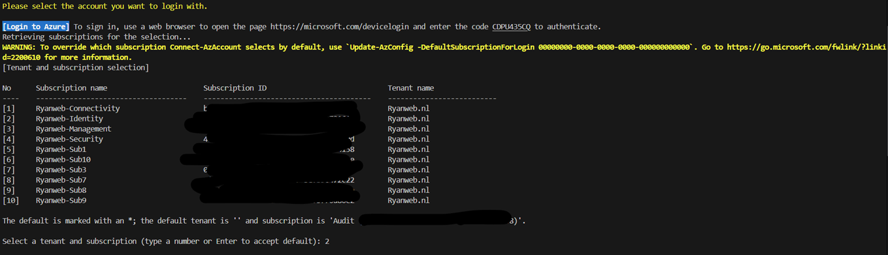
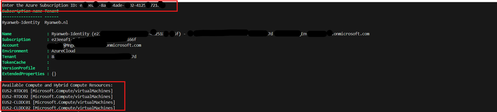
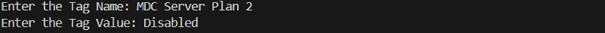
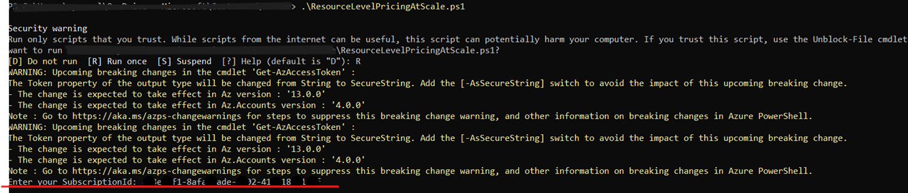
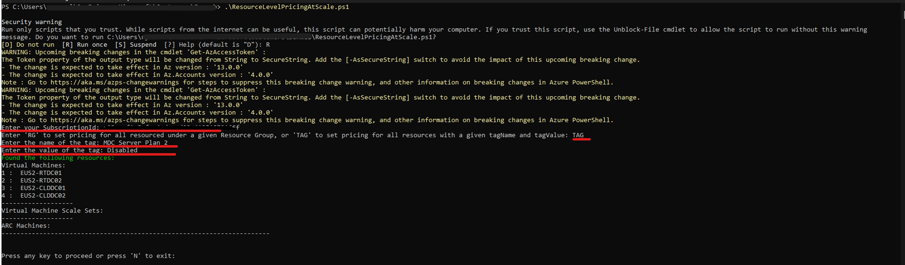
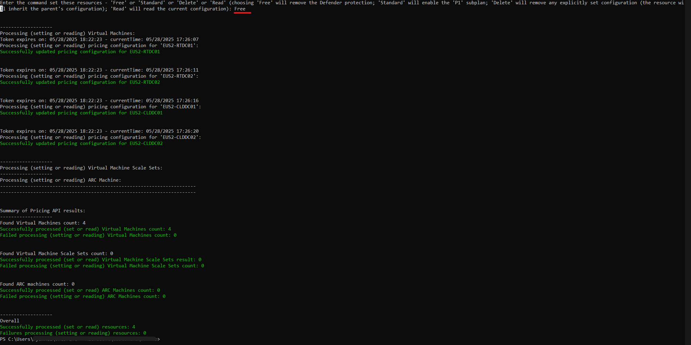
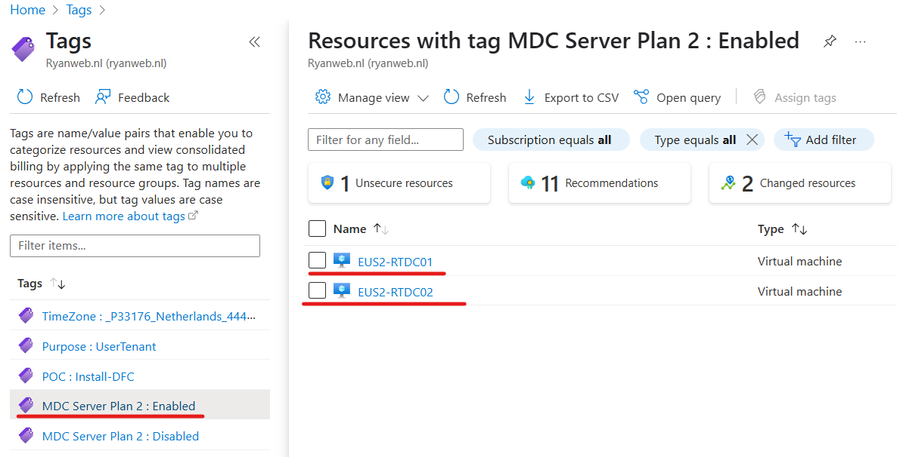
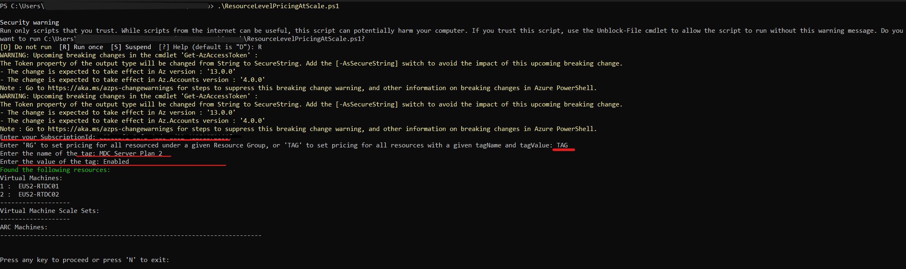
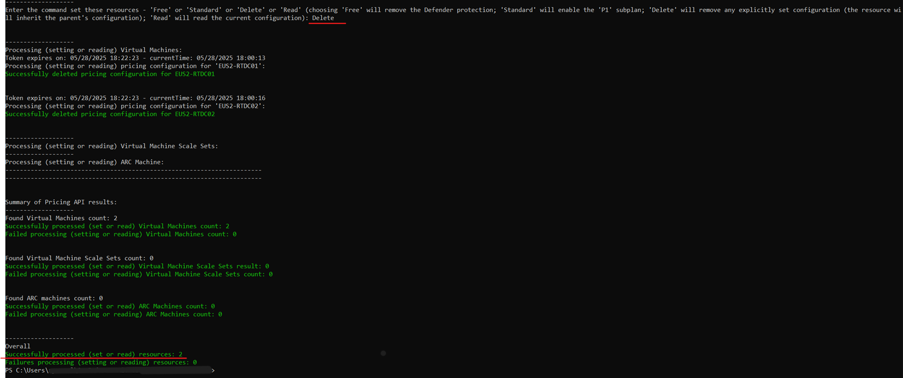
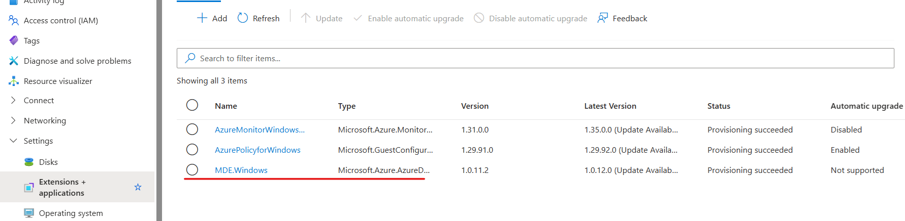

# Granular Defender for Cloud - Server Plan 2 Onboarding

  

Granularly enable Defender for Cloud Server - Plan 2 on a Resource (Per-Machine) Level for a given Azure subsciption. This could be useful for scenarios such as, Server Plan 2 POC or, a Server Plan 2 pilot phase, where the deployment scope should be limited to only a subset of resources.

## Table of Contents

- [Introduction](#introduction)
- [Prerequisites](#prerequisites)
- [Step 1: Create tag values and apply to machines](#step-1-create-tag-values-and-apply-to-machines)
- [Step 2: Apply "Disable Defender for Cloud Server - plan" Config](#step-2-apply-disable-defender-for-cloud-server---plan-config)
- [Step 3: Enable Defender for Cloud Server - Plan 2 on the Subscription](#step-3-enable-defender-for-cloud-server---plan-2-on-the-subscription)
- [Step 4: Update the Tag Value from "Disabled" to "Enabled" for machines that require Server - Plan 2 to be Enabled](#step-4-update-the-tag-value-from-disabled-to-enabled-for-machines-that-require-server---plan-2-to-be-enabled)
- [Step 5: Remove the "Disable Defender for Cloud Server plans" Config for Machines with the "Enabled" Tag Value](#step-5remove-the-disable-defender-for-cloud-server-plans-config-for-machines-with-the-enabled-tag-value)
- [Step 6: Validate Granular onboarding](#step-6-validate-granular-onboarding)
- [Troubleshooting](#troubleshooting)
- [FAQ](#faq)
- [References](#references)

---
## Introduction

Initially, Microsoft provided the ability to Enable the Defender For Cloud - Server Plans, at Subscription level only, which takes an "all or nothing" approach to Workload protection for Machines within a given subscription.
Subsequently, Microsoft has introduced “some” additional deployment options documented here : [Decide on Deployment Scope](https://learn.microsoft.com/en-us/azure/defender-for-cloud/plan-defender-for-servers-select-plan#decide-on-deployment-scope) . 

Microsoft specifically calls out some noteworthy statements in the deployment scope options URL mentioned above :

- **“Plan 2 can't be enabled at the resource level, but you can disable the plan at the resource level.”**

- **“Turn off a plan for specific machines”. “Regardless of whether a plan is turned on or off in a subscription, you can turn off a plan for a specific machine.”**
 
This makes it possible to Disable Plan 2 explicitly on a resource level (/*Machines), while Enabling Plan 2 on a Subscription Level. 

The subscription level configuration will not be Inherited  by  resources ( Machines ) that have been configured to Explicitly Disable Plan 2.

This allows customers the ability to **Granularly apply Server - Plan 2 ,** by using :

- [Azure Tags](https://learn.microsoft.com/en-us/azure/azure-resource-manager/management/tag-resources) 

- [Defender for Servers activation on resource level script](https://github.com/Azure/Microsoft-Defender-for-Cloud/blob/main/Powershell%20scripts/Defender%20for%20Servers%20on%20resource%20level/ResourceLevelPricingAtScale.ps1)
- Azure Policy [_Configure Azure Defender for Servers to be disabled for resources (resource level) with the selected tag_](https://portal.azure.com/#blade/Microsoft_Azure_Policy/PolicyDetailBlade/definitionId/%2Fproviders%2FMicrosoft.Authorization%2FpolicyDefinitions%2F080fedce-9d4a-4d07-abf0-9f036afbc9c8) **Not covered in this Guide!**  

## Important Considerations 

- Once steps 1 - 6 have been completed, **all new Machines onboarded/created to the subscription in scope will be automatically onboarded to Defender for Cloud - Server Plan 2**, as it will apply the Defender for Cloud Server - Plan 2 config defined at the subscription level.  
- It's important to remember that the "secret sauce" here is that the resource level config overrides the Subscription level config. Any new machine introduced into the Subscription will not have this configuration defined (Step 1 and Step 2). 

## Prerequisites

- [Defender for Servers activation on resource level script](https://github.com/Azure/Microsoft-Defender-for-Cloud/blob/main/Powershell%20scripts/Defender%20for%20Servers%20on%20resource%20level/ResourceLevelPricingAtScale.ps1)
- [AZVM_Tagger.ps1](https://github.com/Azure/Microsoft-Defender-for-Cloud/blob/main/Powershell%20scripts/Defender%20for%20Servers%20on%20resource%20level/AZVM_Tagger.ps1)
- Start with Defender for Cloud - Server plan 2 in a Disabled/Off state, on the subscription in scope
- The Subscription ID of the Subscription in scope

## Step 1: Create tag values and apply to machines

1. Download,execute and authenicate [AZVM_Tagger.ps1](https://github.com/Azure/Microsoft-Defender-for-Cloud/blob/main/Powershell%20scripts/Defender%20for%20Servers%20on%20resource%20level/AZVM_Tagger.ps1):  

2. The Script will prompt for a *Subscription ID*. Supply the Subscription ID where your Machines are located. The script will then output all Resources found in the subscription :

3. The script will prompt for the _Tag Name_ , and _tag value_ : I used the below values :
 Name : **_MDC Server Plan 2_**  
 Value : **_Disabled_**  
  

4. Confirm the machines in subscription are tagged.

## Step 2: Apply "Disable Defender for Cloud Server - plan" Config 

1. Run the [Defender for Servers activation on resource level script](https://github.com/Azure/Microsoft-Defender-for-Cloud/blob/main/Powershell%20scripts/Defender%20for%20Servers%20on%20resource%20level/ResourceLevelPricingAtScale.ps1) and authenicate if prompted. 

2. The script will then ask you to Supply a **_Subscription ID_** , use the same Subscription ID that was used in step 1.2 and press Enter.

3. The script will now ask which Mode to use for Targetting, type **_TAG_** ,and press Enter ( We want to apply the config using the tags )  
4. The script will now ask for the Tag Name and Tag Value. **_Supply the values that was used in step 1.3_** and press Enter.

4. As per the above screenshot, The script will return the servers found with the Tag Name and Values supplied in the previous step. **_Review and confirm the Machines_** in the list and then press any key to continue.
5. The script will now move to Configuration mode, where it will prompt you to provide the configuration option for the servers in scope, specify **"Free"** and press Enter.  (This option will explicitly define "MDC Server Plan - Disabled").

(Once the above steps are complete, you have explicitly set  Defender for Cloud server Plans, to Disabled, on the Resource Level, for all Machines in the supplied Subscription ID **This overrides ANY Defender for Cloud Server Plan settings defined on the subscription level**.)

## Step 3: Enable Defender for Cloud Server - Plan 2 on the Subscription

For the Subscription that was supplied in Step 1 and Step 2, follow the Defender for Cloud - Server Plan 2 enablement steps outlined here : [Deploy Defender for Servers](https://learn.microsoft.com/en-us/azure/defender-for-cloud/tutorial-enable-servers-plan#enable-on-azure-aws-or-gcp)

## Step 4: Update the Tag Value from "Disabled" to "Enabled" for machines that require Server - Plan 2 to be Enabled
 
You can use a powershell script or Rest API call to automate this, for the sake of simplicity the modification was performed using the Portal : 

## Step 5:Remove the "Disable Defender for Cloud Server plans" Config for Machines with the "Enabled" Tag Value

1. Once again, run the [Defender for Servers activation on resource level script](https://github.com/Azure/Microsoft-Defender-for-Cloud/blob/main/Powershell%20scripts/Defender%20for%20Servers%20on%20resource%20level/ResourceLevelPricingAtScale.ps1) and authenicate if prompted. 

2. Again, the script will then ask you to Supply a **_Subscription ID_** , use the same Subscription ID that was used in step 1.2 and press Enter.

3. The script will now ask which Mode to use for Targetting, type **_TAG_** ,and press Enter 

4. Again, the script will now ask for the Tag Name and Tag Value. Supply the same **_Tag Name_** that was defined in step 1.3.  
This Time , when the script prompts for a **Tag Value , supply the new Value : "Enabled"**

4. Again, as per the above screenshot, The script will return the servers found with the Tag Name and Value's supplied in the previous step. Review and confirm the Machines in the list and then press any key to continue. Confirm that the machines in the output are the machines were Server - Plan 2 needs to be enabled, and press any key to proceed  
5. The script will now move to Configuration mode, where it will prompt you to provide the configuration option for the servers in scope, specify **_"Delete"_** and press Enter.  
( This option will Delete any explicitly defined configuration and the Machine will inherit configuration from the subscription" ).

## Step 6: Validate Granular onboarding 

If steps 1 - 5 were followed the **MDE.windows extension should be provisioned to all machines** in the subscription with the Tag value set to "Enabled" :

## Troubleshooting

_Common issues and how to resolve them._

## FAQ

[Look here](https://learn.microsoft.com/en-us/azure/defender-for-cloud/faq-defender-for-servers)

## References

[Select a Defender for Servers plan - Microsoft Defender for Cloud](https://learn.microsoft.com/en-us/azure/defender-for-cloud/plan-defender-for-servers-select-plan#decide-on-deployment-scope)  
[Deploy Defender for Servers in Microsoft Defender for Cloud - Microsoft Defender for Cloud](https://learn.microsoft.com/en-us/azure/defender-for-cloud/tutorial-enable-servers-plan#enable-defender-for-servers-at-the-resource-level)  
[Microsoft-Defender-for-Cloud/Powershell scripts/Defender for Servers on resource level at main · Azure/Microsoft-Defender-for-Cloud · GitHub](https://github.com/Azure/Microsoft-Defender-for-Cloud/tree/main/Powershell%20scripts/Defender%20for%20Servers%20on%20resource%20level)  
[Use tags to organize your Azure resources and management hierarchy - Azure Resource Manager](https://learn.microsoft.com/en-us/azure/azure-resource-manager/management/tag-resources)  
[Deploy Defender for Servers in Microsoft Defender for Cloud - Microsoft Defender for Cloud ](https://learn.microsoft.com/en-us/azure/defender-for-cloud/tutorial-enable-servers-plan#disable-defender-for-servers-on-a-subscription)
